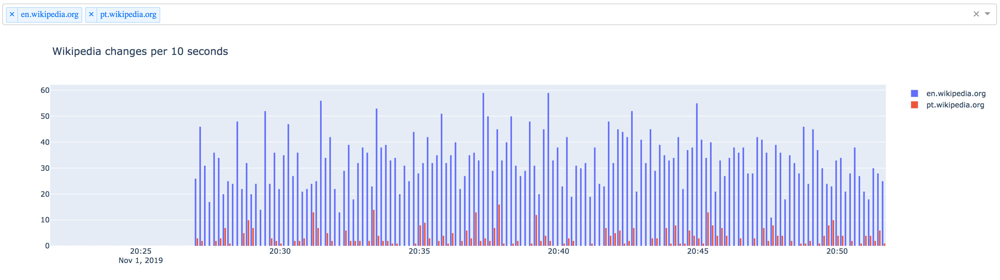

Visualizing Wikipedia updates stream with Redis
===============================================

Wikipedia provides a real-time [SSE](https://developer.mozilla.org/en-US/docs/Web/API/Server-sent_events)
feed for updates for all wikimedia projects.

Documentation about event streams from Wikipedia:
https://wikitech.wikimedia.org/wiki/Event_Platform/EventStreams

Event stream source is available at https://stream.wikimedia.org/v2/stream/recentchange

The easiest way to visualize it:

```
curl https://stream.wikimedia.org/v2/stream/recentchange
```

Running Redis server
--------------------

To run these examples you need to run a Redis server.

```
docker-compose up
```

Installing dependencies
-----------------------

Dependencies installed with pipenv.

```
pipenv install
```


Redis pub-sub from SSE
----------------------

The file [redis_publisher.py](./redis_publisher.py) shows how to publish messages to
the channel. The script reads messages from SSE and publishes them to the channel
"wiki".

Run the script:

```
pipenv run ./redis_publisher.py
```

It immediately starts publishing events to the channel. You can visualize them
with a simple Redis client

```
redis-cli subscribe wiki
```

Type Ctrl+C to quit.

Time-series events with Redis
-----------------------------

There is a script [redis_subscriber.py](./redis_subscriber.py) which consumes
the events from the pub-sub channel and saves them to a time-series events.

Resulting data structure has following properties:

- Events aggregated by domain name.
- Hardcoded value `expiration_timeout_sec` defines how long events are
  stored in Redis
- Another hardcoded value `aggregation_interval_sec` defines the event
  aggregation interval (in seconds).

Run the script:

```
pipenv run ./redis_subscriber.py
```

As a result of the script work, a number of keys will be created in Redis:

```
$ redis-cli
127.0.0.1:6379> keys *
...
7306) "ev:www.wikidata.org:1572640220"
7307) "ev:no.wikipedia.org:1572642080"
7308) "ev:cs.wiktionary.org:1572640550"
```

Each key contains a integer value: the number of events for the specific
domain name, happening within `aggregation_interval_sec` after the time moment,
encoded as the timestamp in the key.


Visualizing time-series events with Dash
-----------------------------------------

Dash is an open source web framework to build interactive data-driven
applications, primarily data visualizations and dashboards.

File [dash_app.py](./dash_app.py) contains a sample application which lets
you pick one or more domain names to get te update statistics for it.

Run the script

```
pipenv run ./dash_app.py
```

As a result, you should see:


