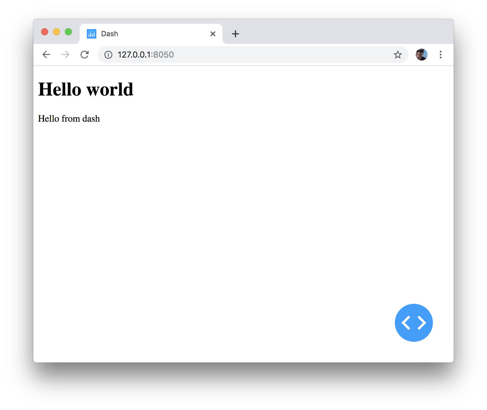
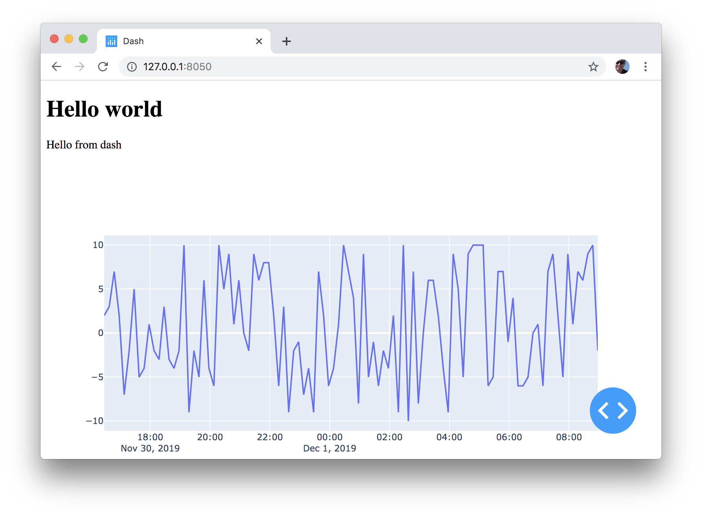
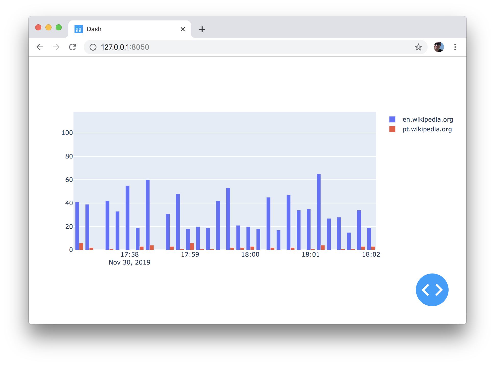
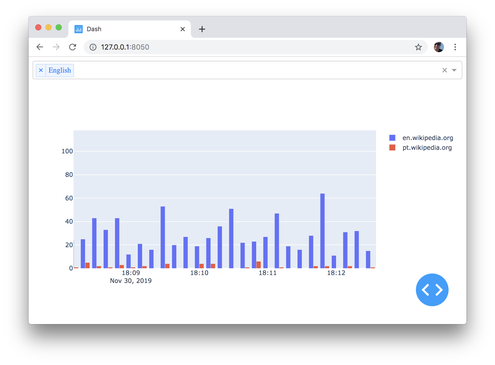
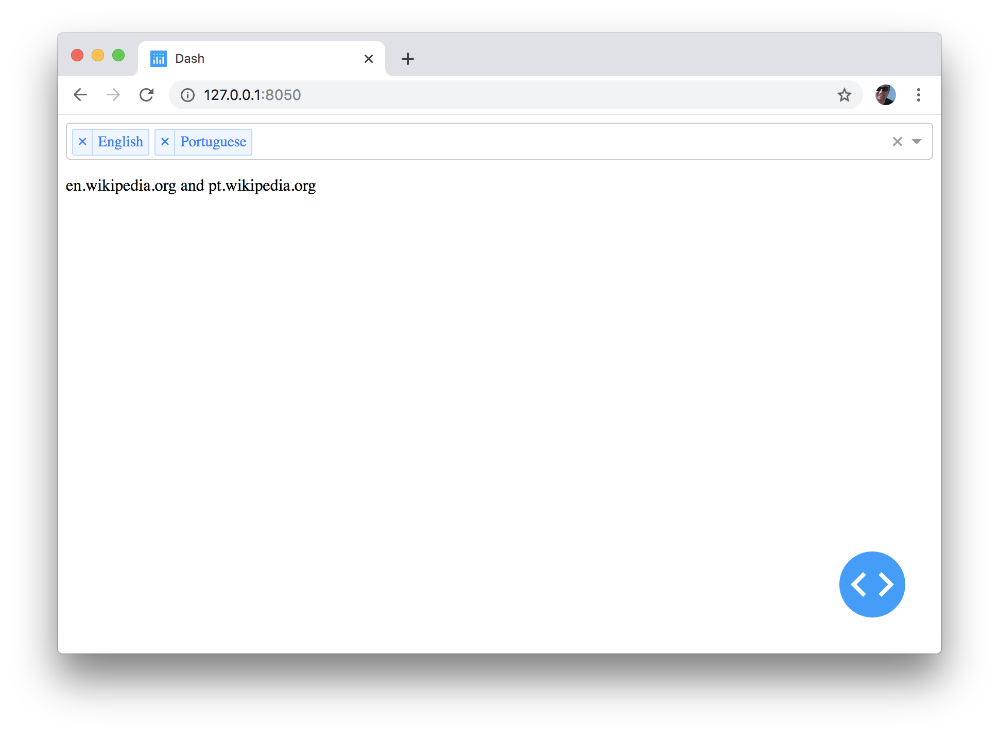
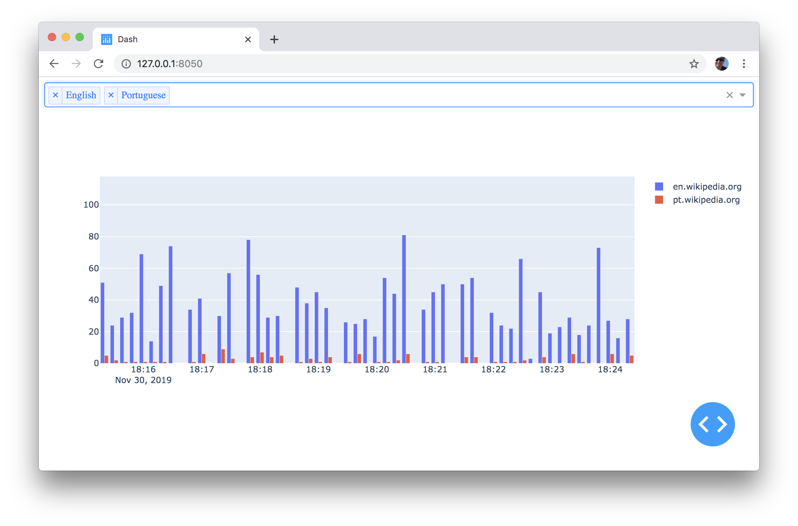

# Dash and plotly

## Part 2. Visualization

note:
It's the outline of the second part of the challenge: plot you data, collected
to Redis hashes. Before we jump right to our data, we need to digress to learn
some basics of Dash and plotly.py

---

## Installing Plotly Dash

```bash
pip install dash
```

Doc: https://dash.plot.ly/installation

note:
Dash applications are web servers running Flask and communicating JSON packets
over HTTP requests. Dash’s frontend renders components using React.js, the
Javascript user-interface library written and maintained by Facebook.

note:
Dash leverages the power of Flask and React, putting them to work for Python
data scientists who may not be expert Web programmers. [dash-intro](https://medium.com/plotly/introducing-dash-5ecf7191b503)

---

## Hello world

```python
# file: dash_app.py
import dash
import dash_html_components as html

app = dash.Dash(__name__)

app.layout = html.Div(children=[
    html.H1(children="Hello world"),
    html.P(children="Hello from dash"),
])

if __name__ == "__main__":
    app.run_server(debug=True)
```

note:
Here's a simple Hello world dash application. Run the app with
`python dash_app.py` and open the browser at http://localhost:8050.

---

## Hello world in a browser



note:
Right now it looks like an overly complicated and limited version of HTML. You can get exactly the same result with simple HTML. And why it's limited? Because by setting a layout property of the app, you define the layout of exactly (and only) one page.

note:
This is important to emphasize. Dash creates applications as single-page apps. You can create apps that look and behave like they have multiple pages, available in multiple URLs, and it's documented how you can do that, but this is out of the scope of the workshop.

note:
Other things to note: your guess of how it's rendered behind the scenes can be wrong. No, objects are not converted to HTML tags and concatenated together to create a static HTML page. Instead, a bare-bones version of the page is returned, and then these elements converted to JSON representations which in their turn converted to React objects on the client side.

---

## Working with plots

note:
Our next step is to add a plot. For the sake of simplicity we'll first create a plot with hardcoded time series. There will be some random numbers from -10 to 10.

note: Extend your file with the following lines of the code to create a time series object.

```python
import random
import datetime

now = datetime.datetime.utcnow()
x = [now + datetime.timedelta(minutes=10 * i) for i in range(100)]
y = [random.randint(-10, 10) for i in range(100)]
```

---

## Working with plots

note:
Import two modules and create two objects:

```python
import dash_core_components as dcc
from plotly import graph_objects as go

scatter = go.Scatter(x=x, y=y, name="Random process")
fig = go.Figure(data=[scatter])
graph = dcc.Graph(id="graph", figure=fig)

app.layout = html.Div(
    children=[
        ...
        graph,
    ]
)
```

note:
Here come two moments.

note:
First, we imported dash_core_components. It's a module with widgets that are more than simple wrappers around HTML: dropdowns, sliders, etc. [ref](https://dash.plot.ly/dash-core-components/). For our case we use a `dcc.Graph`, a simple wrapper to put a figure inside.

note:
Second, we imported and made use of so-called "plotly graph objects". Here comes time to talk more about plotly object model.

---

## Working with plots



note:
Plotly object model

note:
The core of plotly is a javascript library, which can be used without any Python or server-side code whatsoever. You can create an HTML page, include there a plotly javascript library with a `<script>` tag, and then call plotly functions to draw charts inside a chosen div.

note:
It's important to remember that charts defined declaratively (in contrast to imperative definitions). With declarative definition, instead of calling functions like "plot me a line", and then "set a title", one by one, you create a full specification of your plot in the form of a deeply nested JSON object. Then you pass this specification to a function, saying "draw me a chart against this spec into that HTML div". That's it!

note:
Ok, but what Python library is needed for? There are two things.

note:
First, it provides a so-called renderer. Most appropriate rendered is chosen automatically depending on your environment, or you can set it manually. The simplest renderer is "browser". Plotly will create an HTML page, include in that page all necessary div's, css's and javascript files and open the browser to render that page. More complex cases (hidden from us behind the layers of abstractions) include rendering plots in jupyter notebook or, in dash applications.

note:
https://plot.ly/python/renderers/

note:
And second, and this is why I started talking about graph objects, Python helps you not to get lost yourself in deeply nested declarative JSON structures. Instead of building deeply nested JSON structures, you'll create a graph with a tree of nested graph objects. The main advantage of this approach is readability. You can clearly see object types. Second advantage is that graph object provide additional help, like type validation and docstrings.

note:
For the list of graph objects go to https://plot.ly/python/reference/

---

## Data that we have

note:
Just a reminder that what we have at the moment in the database is a list of
hashes:

List of hashes

```redis
127.0.0.1:6379> keys *
  1) "ev:sl.wikiquote.org"
  2) "ev:bs.wikipedia.org"
  3) "ev:sv.wikipedia.org"
  4) "ev:sv.wikisource.org"
  5) "ev:incubator.wikimedia.org"
...
```

note:
Every hash has a timestamp as a key and the number of events as a value:

Hash structure

```redis
127.0.0.1:6379> hgetall ev:pt.wikipedia.org
  1) "1572647620"
  2) "2"
  3) "1572647630"
  4) "2"
  5) "1572647640"
  6) "2"
...
```

---

## Data that we have

```python
In [1]: import redis
In [2]: r = redis.Redis(decode_responses=True)
In [3]: r.hgetall("ev:pt.wikipedia.org")
Out[3]:
{'1572647620': '2',
 '1572647630': '2',
 '1572647640': '2',
 ...
```

---

## Data that we have

note:
Let's make sense of these data by getting them from Redis, and extracting them to X and Y datasets

Create X and Y

```python
import redis
import datetime

r = redis.Redis(decode_responses=True)

elements = sorted(r.hgetall("ev:en.wikipedia.org").items())
x = [datetime.datetime.fromtimestamp(int(e[0])) for e in elements]
y = [e[1] for e in elements]
```

---

## Data that we have


---

## Data that we have

note:
Same figure can contain multiple traces. We've just create one trace for en.wikipedia.org. Try to create another trace for pt.wikipedia.org and display them on the same figure.

Try to make it look like this:



---

## Adding interactivity

note:
Let's add interactivity to our application. We'll do it step by step, and for the beginning we'll create a dropdown.

```python
domains = dcc.Dropdown(
    id="domains",
    value=["en.wikipedia.org"],
    multi=True,
    options=[
        {"label": "English", "value": "en.wikipedia.org"},
        {"label": "Portuguese", "value": "pt.wikipedia.org"},
    ],
)
app.layout = html.Div(children=[domains, ...])
```

note:
Try to reimplement the code from the top to update your image so that it'd look like on the bottom.

Doc: https://dash.plot.ly/dash-core-components

---

## Adding interactivity



note:
At the moment nothing happens yet. The client can change the values in the dropdown, but we won't be able to reflect these changes. Now it's time to learn about callbacks.

---

## Adding interactivity

note:
for the sake of simplicity we move back from barplots for a second, and try to
visualize our changes with simple text

```python
from dash.dependencies import Input, Output

domains = dcc.Dropdown(...)
info = html.P("Hello world", id="info")
app.layout = html.Div(children=[domains, info])

@app.callback(
    Output(component_id="info", component_property="children"),
    [Input(component_id="domains", component_property="value")],
)
def update_output_div(domains):
    return " and ".join(domains)
```

Doc: https://dash.plot.ly/getting-started-part-2

---

## Adding interactivity

note:
The text in the info element is changed in response to your changes in the dropdown.



---

## Adding interactivity

note:
our next goal is to replace this component with our plot. Instead of HTML component we'll get back to `dcc.Graph`, and instead `children` we need to update its `graph` attribute.

```python
def figure(domains):
    ...
    return go.Figure(data=data)

def barplot(domain):
    ...
    return go.Bar(x=x, y=y, name=domain)

@app.callback(
    Output(component_id="graph", component_property="figure"),
    [Input(component_id="domains", component_property="value")],
)
def update_figure(domains):
    return figure(domains)
```

---

## Adding interactivity



---

# Homework

- Add the full list of domains to dropdown
- Add live update for plots

Doc: https://dash.plot.ly/live-updates
